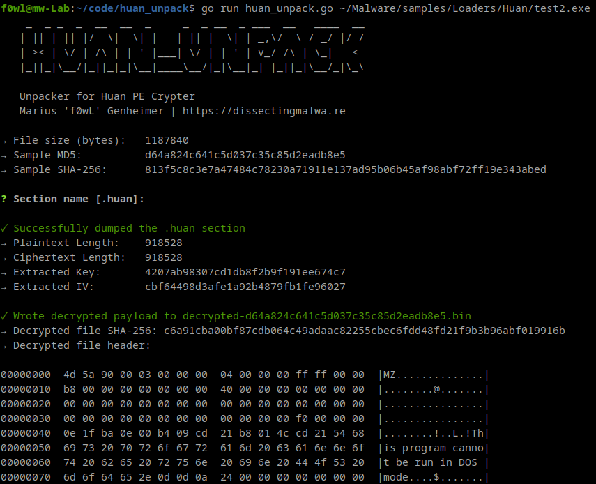
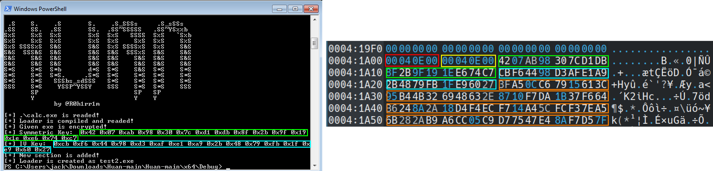

# huan_unpack

A simple unpacking script for the [Huan PE Crypter](https://github.com/frkngksl/Huan) by Furkan Göksel. Since this Crypter will likely be used for malicious purposes sooner rather than later I chose to write this unpacking script and a matching [Yara rule](https://github.com/f0wl/yara_rules/blob/main/windows/crypter/huan_crypter.yar) to detect the usage of Huan.

### Usage

```shell
go run huan_unpack.go path/to/sample.exe
```

## Screenshot


### How does it work?

The payload is encrypted (orange) with AES-CBC and Key (green) and IV (blue) (along with the length of the plain- (red) and ciphertext (yellow)) are stored in the ```.huan``` section of the Loader binary.


